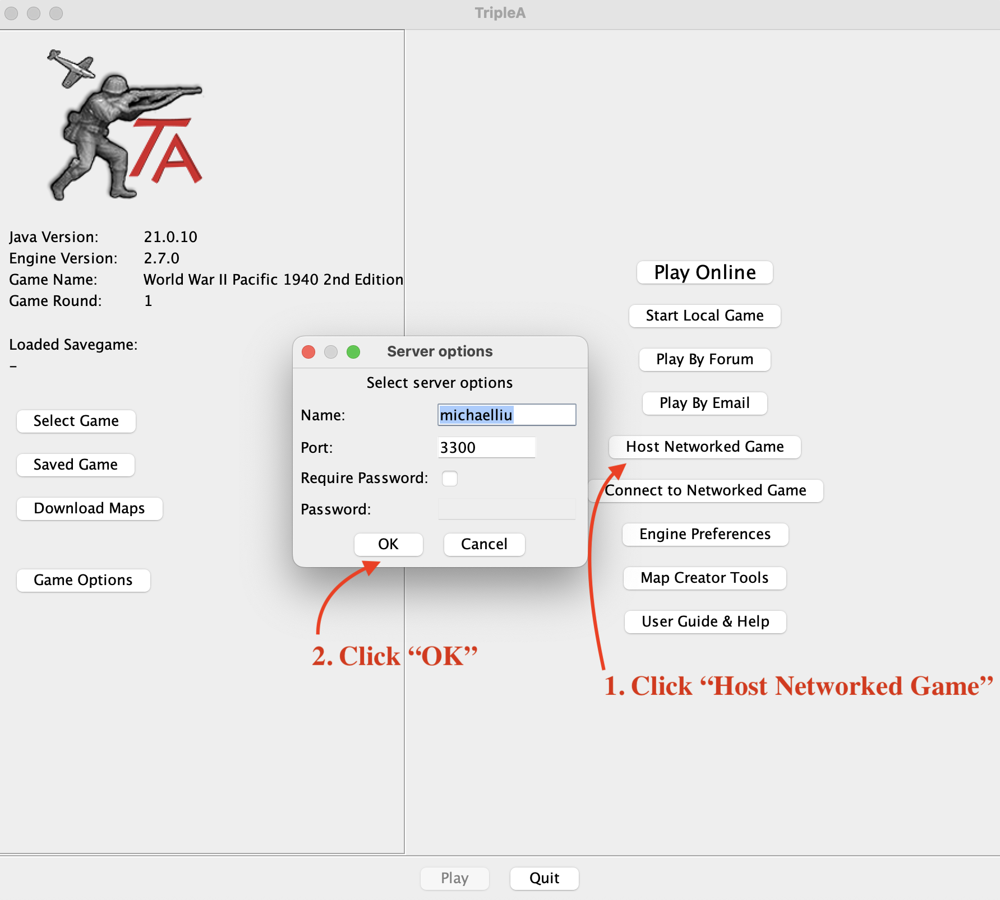
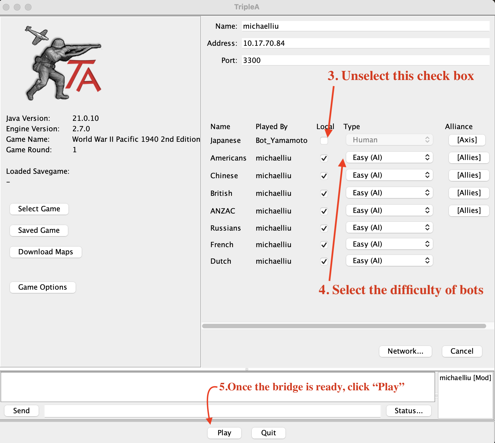

# Reflexion-Wargame-Agent

A self-evolving wargame AI agent that learns from its own gameplay experience. Built on LLMs with a **3-layer Reflexion** framework and **hybrid RAG** retrieval — achieving interpretable, training-free strategic reasoning in TripleA's *World War II Pacific 1940* scenario.

<p align="center">
  
</p>

## 3-Layer Reflexion Architecture

The agent improves through three layers of feedback operating at increasing time scales:

```
  Time Scale        Layer                    Feedback Loop
  ───────────────────────────────────────────────────────────────────────────────

  Per Phase    ┌─────────────────────┐
               │  L1  Phase          │   Agent acts → Criticizer checks
               │      Criticizer     │   → blocks if missed actions
               └─────────┬───────────┘   → agent corrects → retry
                          │
  Per Round    ┌──────────▼──────────┐
               │  L2  Round          │   Board snapshot diff → score dropped?
               │      Reflection     │   → LLM generates tactical lesson
               └─────────┬───────────┘   → stored in FAISS (same-game retrieval)
                          │
  Per Game     ┌──────────▼──────────┐
               │  L3  Game           │   Strategic plan review → structured lessons
               │      Reflection     │   → experiences.json + national_strategy.json
               └─────────┬───────────┘   → RAG retrieval in future games
                          │
               ┌──────────▼──────────┐
               │  Hybrid RAG         │   BM25 + FAISS + RRF fusion
               │  (Experience Pool)  │   → injected into Round Plan & phase prompts
               └─────────────────────┘
```

### L1 — Phase Criticizer (per phase, real-time correction)

A gate embedded in `tool_end_turn()` that **blocks** premature phase advancement and provides actionable instructions:

- **Combat Move**: Detects unattacked empty territories (free captures) and loaded transports that haven't performed amphibious assaults
- **NCM**: Detects idle transports and undeployed ground troops on Japan
- **Plan Generation**: Validates that new strategic plans target the China conquest objective

No persistent experience is generated — correction happens in-place within the same phase.

### L2 — Round Reflection (per round, intra-game learning)

After each round, compares `BoardSnapshot` (score, territory control, army value). If score dropped or no new territory was captured, an LLM generates a concrete tactical lesson:

> *"Round 2: 8 infantry idle on Japan with only 1 transport. Must buy 2 transports in round 1 to ship 4 units/round."*

Lessons are immediately indexed into FAISS — subsequent rounds **within the same game** can retrieve them via RAG.

### L3 — Game Reflection (per game, cross-game evolution)

After the full game ends, each strategic plan receives a structured review (`StrategicPlanReview`). Lessons are persisted to:
- `experiences.json` — long-term experience storage
- `national_strategy.json` — updates plan confidence, known risks, and lessons learned

Future games retrieve these lessons via **hybrid RAG** (BM25 keyword search + FAISS semantic search, fused with Reciprocal Rank Fusion) and inject them into Round Plans and phase instructions.

---

## Ablation Configurations

Three configurations for controlled experiments:

| Capability | A (Baseline) | B (RAG) | C (Full) |
|:-----------|:---:|:---:|:---:|
| Round Plan generation | ✓ | ✓ | ✓ |
| L3 — Game Reflection + storage | — | ✓ | ✓ |
| RAG injection into Round Plan | — | ✓ | ✓ |
| L2 — Round Reflection | — | — | ✓ |
| L1 — Phase Criticizer | — | — | ✓ |
| Per-phase RAG injection | — | — | ✓ |

```bash
python main.py --config A   # Baseline
python main.py --config B   # RAG only
python main.py --config C   # Full system (default)
```

---

## Project Structure

```
LangChain_RAG_WargameBot/
├── RRagent/agent/
│   ├── src/
│   │   ├── main.py            # Game loop, config, milestone checks
│   │   ├── agent.py           # LLM agent, tools, Criticizer, Round Plan
│   │   ├── memory.py          # BoardSnapshot, Reflexion, GameMemory (RAG)
│   │   ├── bridge_client.py   # Python ↔ Java Bridge HTTP client
│   │   ├── battle_predictor.py# Monte Carlo battle odds simulation
│   │   └── display.py         # Terminal UI formatting
│   ├── knowledge/
│   │   ├── rules.txt          # Game rules (indexed by FAISS)
│   │   ├── national_strategy.json  # Evolving strategic plans
│   │   ├── rules_index/       # FAISS index for rules
│   │   └── exp_index/         # FAISS index for experiences
│   ├── memory/
│   │   └── experiences.json   # Persisted game lessons
│   ├── results/
│   │   └── game_results.csv   # Quantitative results per game
│   ├── requirements.txt
│   └── .env                   # OPENAI_API_KEY
│
├── triplea-game-bridge/
│   └── game-app/game-bridge/  # Java Bridge (BridgePlayer, BridgeRuntime)
│
└── assets/                    # Screenshots for documentation
```

---

## Quick Start

> The three terminals must be started in order. Do not skip ahead.

### Prerequisites

- Java 11+ (for TripleA + Bridge)
- Python 3.11+
- OpenAI API key
- TripleA map: `World War II Pacific 1940 2nd Edition`
  (If missing: open TripleA → **Maps → Download Maps** → search and install)

### Terminal 1 — TripleA Game (GUI)

```bash
cd triplea-game-bridge
./gradlew :game-app:game-headed:run
```

Once the GUI opens:
1. Click **Play → Start Local Game**
2. Select map: `World War II Pacific 1940 2nd Edition`
3. Set **Japan** → `Human`, all others → `Hard (AI)`
4. Click **Host** — game waits for connection on port `3300`



### Terminal 2 — Java Bridge

```bash
cd triplea-game-bridge
./gradlew :game-app:game-bridge:run \
  --args="--host 127.0.0.1 --port 3300 --name Bot_Yamamoto --take Japanese"
```

Wait for:
```
Bridge connected and took player: Japan
Bridge HTTP server listening on port 8081
```



### Terminal 3 — Python AI Agent

```bash
cd RRagent/agent

# First time: create venv and install dependencies
python3.11 -m venv src/.venv
source src/.venv/bin/activate
pip install -r requirements.txt

# Configure API key
echo "OPENAI_API_KEY=sk-your-key-here" > .env

# Run agent (default: Config C, full system)
cd src
python main.py --config C
```


---

## CLI Reference

```bash
python main.py --config {A,B,C}   # Ablation configuration (default: C)
python main.py --clean             # Clear experience pool before start
```

| Flag | Description |
|------|-------------|
| `--config A` | Baseline — no reflection, no RAG |
| `--config B` | RAG — game-level reflection + experience retrieval |
| `--config C` | Full — L1 + L2 + L3 reflexion, per-phase RAG |
| `--clean` | Delete `exp_index/` and `experiences.json` (use when switching configs) |

---

## Scoring System

The agent's performance is evaluated quantitatively per round:

```
score = japan_controlled_china_ipc − china_army_remaining_value
```

- **japan_controlled_china_ipc**: Sum of IPC values of Chinese territories controlled by Japan
- **china_army_remaining_value**: Estimated IPC value of surviving Chinese military units

Higher score = better for Japan. Score trajectory is logged per round and saved to `results/game_results.csv`.

---

## Troubleshooting

| Problem | Solution |
|---------|----------|
| Bridge fails to connect | Ensure Terminal 1 game is fully loaded and waiting on port 3300 |
| Agent not responding | Confirm Terminal 2 shows `listening on port 8081` |
| Map not found | TripleA → Maps → Download → search `Pacific 1940 2nd Edition` |
| `ModuleNotFoundError` | Activate venv: `source src/.venv/bin/activate` |
| API key error | Check `RRagent/agent/.env` contains valid `OPENAI_API_KEY` |
| Stale experience data | Run with `--clean` to reset experience pool |

---

## License

See [LICENSE.txt](LICENSE.txt).
